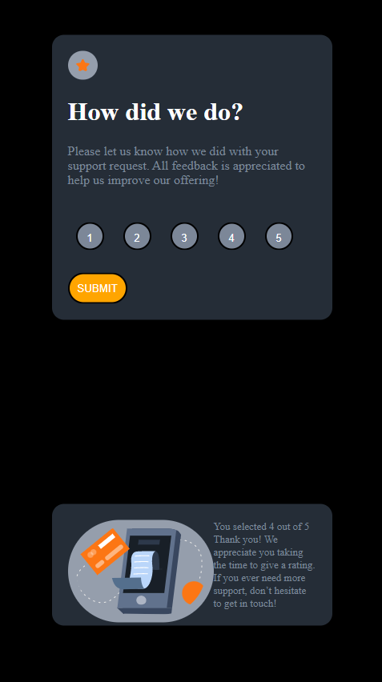
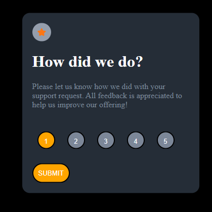
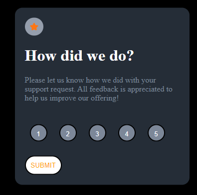

# Frontend Mentor - Interactive rating component solution

This is a solution to the [Interactive rating component challenge on Frontend Mentor](https://www.frontendmentor.io/challenges/interactive-rating-component-koxpeBUmI). Frontend Mentor challenges help you improve your coding skills by building realistic projects. 

## Table of contents

- [Overview](#overview)
  - [The challenge](#the-challenge)
  - [Screenshot](#screenshot)
- [My process](#my-process)
  - [Built with](#built-with)
  - [What I learned](#what-i-learned)
  - [Continued development](#continued-development)
- [Author](#author)
- [Acknowledgments](#acknowledgments)

**Note: Delete this note and update the table of contents based on what sections you keep.**

## Overview

### The challenge

Users should be able to:

- View the optimal layout for the app depending on their device's screen size
- See hover states for all interactive elements on the page
- Select and submit a number rating
- See the "Thank you" card state after submitting a rating

### Screenshot

## My process

### Built with

- Semantic HTML5 markup
- CSS custom properties
- JavaScript

### What I learned

Reitirated on my html/css knowledge and added JS to the exercise for more complexity.

### Continued development

Keep doing more exercies to increase working knowledge of the programming languages.

## Author

Abdel Fattah Ibrahim

## Acknowledgments

Development Direction community. Josh for teaching, Kyle for introducing me and Sam for guiding me. To all the members in the community for sharing GitHub with me to get insipiration for code.
